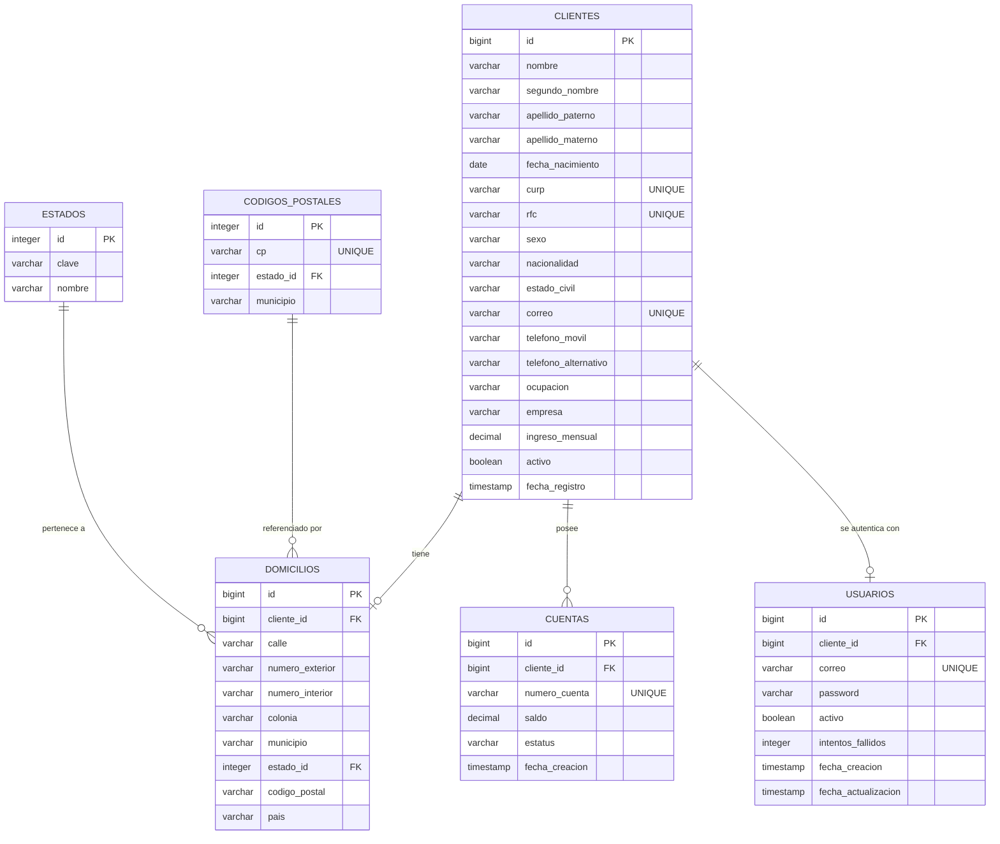

# Onboarding de Clientes - API REST Bancaria

Este proyecto es una API REST desarrollada en Java 17 con Spring Boot para gestionar el registro (onboarding) de clientes en una institución financiera. Permite capturar información personal, crear cuentas bancarias de manera automática, y gestionar usuarios con seguridad basada en JWT.

## Enlaces del Proyecto
- **URL Base de Producción (Render):** https://api-clientes-pwa.onrender.com
- **Documentación Swagger UI:** https://api-clientes-pwa.onrender.com/swagger-ui/index.html

---

## 1. Diagrama Entidad-Relación (ER)

El siguiente diagrama muestra la estructura relacional de la base de datos PostgreSQL implementada:



---

## 2. Tecnologías Utilizadas
- **Lenguaje:** Java 21
- **Framework:** Spring Boot 3.3.6
- **Persistencia:** Spring Data JPA / Hibernate
- **Base de Datos:** PostgreSQL
- **Migraciones:** Flyway
- **Seguridad:** Spring Security con JWT (JSON Web Tokens) y cifrado BCrypt.
- **Documentación:** Swagger (OpenAPI 3)
- **Despliegue:** Docker y Render.

---

## 3. Endpoints Principales

### Autenticación
- `POST /auth/login`: Autentica a un usuario y devuelve un token JWT. (Requiere correo y contraseña). Bloquea la cuenta después de 3 intentos fallidos.

### Clientes
- `POST /clientes`: Registra un nuevo cliente (y en cascada, crea su domicilio, cuenta y usuario). *Endpoint público para registro.*
- `GET /clientes`: Consulta clientes con filtros dinámicos (nombre, apellidoPaterno, apellidoMaterno, curp, rfc, fechas).
- `GET /clientes/{id}`: Consulta un cliente específico por ID.
- `PATCH /clientes/{id}`: Actualización parcial (Solo datos permitidos: domicilio, contacto).
- `PATCH /clientes/{id}/baja`: Da de baja lógica al cliente (y desactiva su cuenta y usuario).

### Cuentas
- `GET /cuentas`: Consulta cuentas con filtros dinámicos (clienteId, estatus, numeroCuenta).
- `POST /cuentas`: Crea manualmente una cuenta adicional para un cliente.
- `PATCH /cuentas/{numeroCuenta}`: Actualización parcial de una cuenta.

---

## 4. Reglas de Negocio Implementadas
- Validación estricta de **CURP (18 caracteres)** y **RFC (12 o 13 caracteres)** mediante Expresiones Regulares.
- Verificación automática de **Mayoría de Edad (18+ años)**.
- **Unicidad:** La base de datos y la API evitan duplicados de CURP, RFC, Correos y Números de Cuenta.
- Contraseñas fuertemente aseguradas mediante **BCrypt**, forzando al menos 8 caracteres, mayúscula, minúscula, número y símbolo.
- Los bloqueos de cuenta tras 3 intentos fallidos de login están configurados globalmente.

---

## 5. Instrucciones de Ejecución Local
Para ejecutar el proyecto en un entorno de desarrollo:

1. Clonar el repositorio.
2. Contar con una base de datos PostgreSQL local corriendo en el puerto `5432` con una base llamada `catalogo_dev`.
3. Ejecutar el proyecto mediante Gradle:
   ```bash
   ./gradlew bootRun --args='--spring.profiles.active=local'
   ```
4. Flyway creará automáticamente todas las tablas al iniciar.
