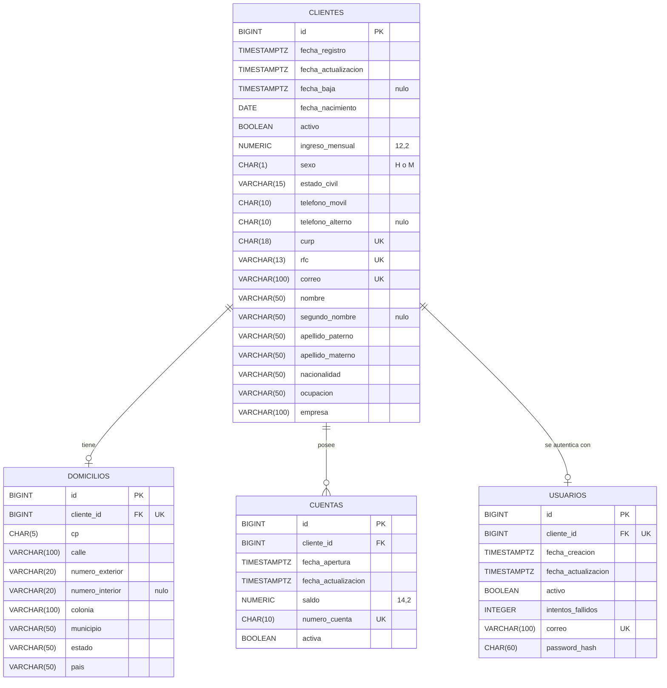

# Onboarding de Clientes (Personas Físicas) – API REST

API REST en Java 17 y Spring Boot para registrar clientes personas físicas, validar su información, crear automáticamente su cuenta bancaria y su usuario de acceso, y consultar o actualizar esa información con autenticación JWT.

## Enlaces
- **API en producción (Render):** https://api-clientes-pwa.onrender.com
- **Swagger UI:** https://api-clientes-pwa.onrender.com/swagger-ui/index.html
- **Script de la base de datos:** [script_creacion_bd.sql](./script_creacion_bd.sql)

> El servicio gratuito de Render se duerme tras un rato sin tráfico: la **primera petición puede tardar cerca de un minuto**.

## Tecnologías
Java 17 · Spring Boot 3.3.6 · Spring Data JPA/Hibernate (con Specifications) · PostgreSQL · Flyway · Spring Security + JWT (jjwt 0.12.6) · BCrypt · OpenFeign (API de códigos postales Postali) · springdoc/Swagger · Gradle · Docker · Render.

## 1. Modelo de datos



Decisiones de diseño: claves `BIGINT`, dinero en `NUMERIC` (nunca flotantes), fechas con zona horaria (`TIMESTAMPTZ`), `BOOLEAN` para estados, `CHAR(n)` solo para longitudes fijas (CURP, teléfonos, CP, cuenta, hash BCrypt de 60). Restricciones con nombre (`pk_`, `uq_`, `fk_`, `ck_`), `ON DELETE RESTRICT` (no hay borrado físico) e índices solo donde se consulta. El número de cuenta sale de la secuencia `seq_numero_cuenta`. (Nota: Los Catálogos de Códigos Postales no están en la BD, se consultan en vivo vía API).

## 2. Autenticación
1. `POST /auth/login` con correo y contraseña devuelve un `token` JWT.
2. Envíalo en cada petición: `Authorization: Bearer <token>`. En Swagger, botón **Authorize** (pega solo el token).
3. Públicos: `POST /auth/login`, `POST /clientes`, Swagger. Todo lo demás requiere token.
4. **Bloqueo por Intentos:** Cada vez que el usuario falla la contraseña, se incrementa `intentos_fallidos`. Al llegar a 3 fallos consecutivos, el usuario se desactiva (`activo = false`) en la base de datos de manera automática. Para desbloquearlo, se requiere intervención directa en la BD (o crear un endpoint administrativo), un usuario inactivo siempre recibirá error `403`. Un inicio de sesión correcto antes del 3er intento reinicia el contador a 0.

## 3. Endpoints

| Método | Ruta | Acceso | Descripción |
|---|---|---|---|
| POST | `/auth/login` | Público | Devuelve el JWT |
| POST | `/clientes` | Público | Registra cliente, domicilio, usuario y cuenta en **una sola transacción** |
| GET | `/clientes` | Token | Búsqueda paginada con filtros combinables |
| GET | `/clientes/{id}` | Token | Detalle (con domicilio y cuentas) |
| PATCH | `/clientes/{id}` | Token | Actualización parcial (no permite CURP, RFC ni número de cuenta) |
| PATCH | `/clientes/{id}/baja` | Token | Baja lógica: desactiva cliente, usuario y cuentas |
| GET | `/cuentas/{numeroCuenta}` | Token | Consulta una cuenta |
| GET | `/cuentas?clienteId=` o `?estatus=` | Token | Cuentas por cliente o por estatus |
| POST | `/cuentas` | Token | Crea una cuenta adicional |
| PATCH | `/cuentas/{numeroCuenta}` | Token | Cambia el estatus (ACTIVA/INACTIVA) |
| GET | `/usuarios/filtro` | Token | Búsqueda paginada de usuarios (`correo`, `activo`, `clienteId`) |
| PUT | `/usuarios/agregar` | Token | Crea el usuario de un cliente activo que no lo tenga |

**Filtros de `GET /clientes`** (se combinan con AND): `nombre`, `apellidoPaterno`, `apellidoMaterno` (contiene, sin distinguir mayúsculas), `curp`, `rfc`, `correo` (exactos), `activo`, `fechaDesde`, `fechaHasta` (`yyyy-MM-dd`) y `numeroCuenta`. Paginación: `page`, `size` (máx. 100) y `sort` (`id`, `nombre`, `apellidoPaterno`, `apellidoMaterno`, `fechaRegistro`, `activo`).

### Ejemplo: registrar un cliente
`POST /clientes`
```json
{
  "nombre": "Ana Maria",
  "apellidoPaterno": "Lopez",
  "apellidoMaterno": "Gomez",
  "curp": "LOGA900101MDFRRN01",
  "rfc": "LOGA900101XYZ",
  "fechaNacimiento": "1990-01-01",
  "sexo": "MUJER",
  "nacionalidad": "MEXICANA",
  "estadoCivil": "SOLTERO",
  "telefonoMovil": "5522334455",
  "correo": "ana.roma@test.com",
  "ingresoMensual": 20000.00,
  "ocupacion": "Arquitecta",
  "empresa": "Constructora Sur",
  "calle": "Orizaba",
  "numeroExterior": "45",
  "colonia": "Roma Norte",
  "cp": "06700",
  "password": "Password123!"
}
```
Respuesta `201`:
```json
{ "clienteId": 4, "nombreCompleto": "Ana Maria Lopez Gomez", "numeroCuenta": "1000000002",
  "correo": "ana.roma@test.com", "mensaje": "Cliente registrado exitosamente." }
```
Estado y municipio **no se envían**: los rellena Postali a partir del CP.

## 4. Formato de errores
Toda respuesta de error tiene `codigo` y `mensaje` (las validaciones agregan `errores` por campo):

| Código | Cuándo |
|---|---|
| 400 | Validación, JSON inválido, tipo incorrecto, CP o colonia inválidos |
| 401 | Token ausente, inválido o vencido; credenciales incorrectas |
| 403 | Usuario inactivo o bloqueado por demasiados intentos |
| 404 | Cliente, cuenta, usuario o código postal inexistente; ruta inexistente |
| 409 | CURP, RFC o correo duplicado; cliente inactivo; usuario ya existente |
| 503 | Servicio de códigos postales (Postali) no disponible |

## 5. Reglas de negocio
- Mayor de edad (18+), fecha de nacimiento no futura.
- CURP (18) y RFC (12 o 13) únicos y con formato válido (expresión regular); correo único (se guarda en minúsculas).
- Teléfonos de 10 dígitos exactos, código postal de 5 dígitos.
- Contraseña: mínimo 8 caracteres, con mayúscula, minúscula, número y carácter especial; se almacena con BCrypt.
- Al registrar se crea una cuenta ACTIVA (número único, saldo inicial 0.00) y un usuario activo.
- Baja lógica: el cliente queda inactivo, su usuario también y sus cuentas pasan a INACTIVA.
- Solo un cliente activo puede tener cuentas activas.
- **Código postal (Postali):** el CP debe existir y la colonia debe pertenecer a él (se compara sin acentos ni mayúsculas); estado y municipio se toman de la API externa (OpenFeign). Si Postali no responde, el registro se rechaza con 503 y no se guarda nada.

## 6. Ejecución local
Requisitos: Java 17+, PostgreSQL con una base `catalogo_dev`.

1. Crea `src/main/resources/application-local.properties` (**no se sube a Git**):
```properties
server.port=8081
spring.datasource.url=jdbc:postgresql://localhost:5432/catalogo_dev
spring.datasource.username=TU_USUARIO
spring.datasource.password=TU_PASSWORD
jwt.secret=VALOR_BASE64_DE_AL_MENOS_32_BYTES
```
2. Ejecuta: `./gradlew bootRun --args='--spring.profiles.active=local'`
3. Flyway crea las tablas al iniciar. Swagger: http://localhost:8081/swagger-ui/index.html

## 7. Despliegue (Render)
Imagen Docker (`Dockerfile`) y PostgreSQL gestionado en la nube. Variables de entorno: `SPRING_DATASOURCE_URL`, `SPRING_DATASOURCE_USERNAME`, `SPRING_DATASOURCE_PASSWORD`, `JWT_SECRET`, `GESTOPAGO_AUTH_URL` y `POSTALI_URL`. 
